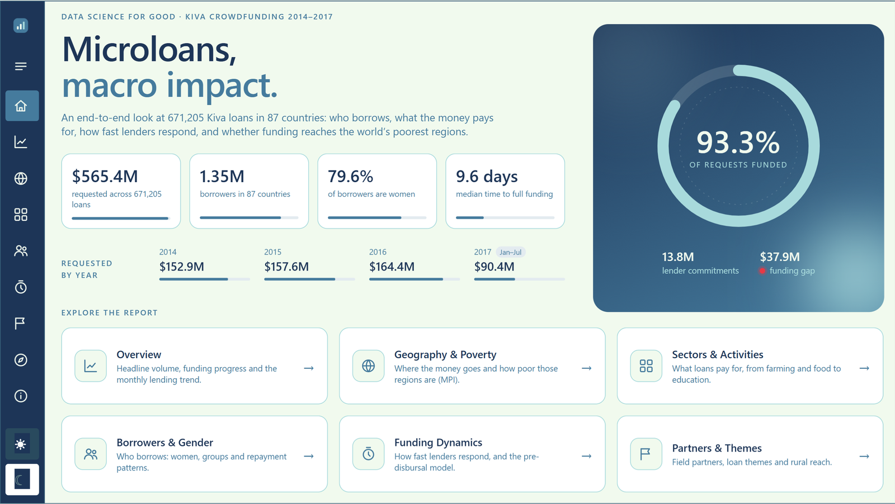
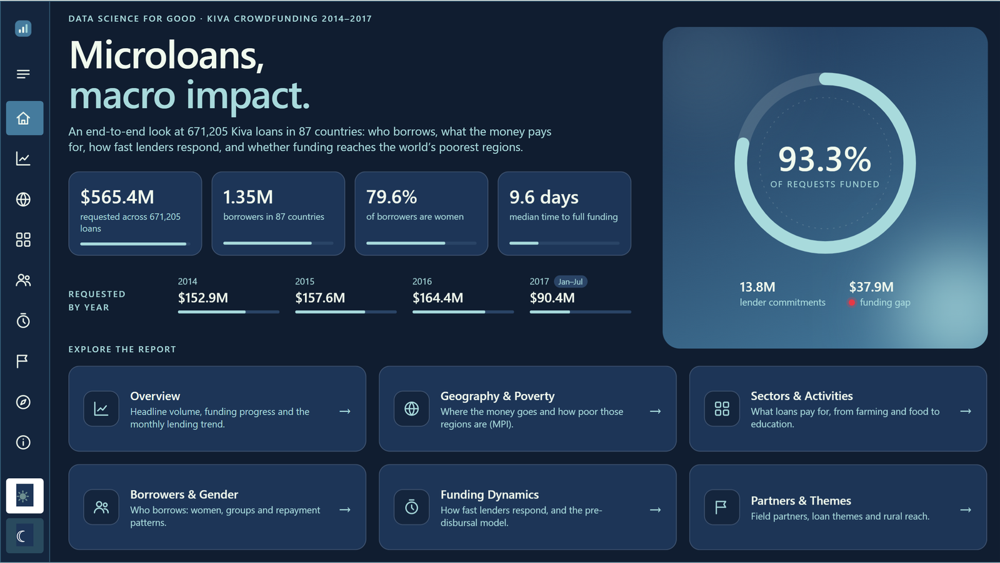
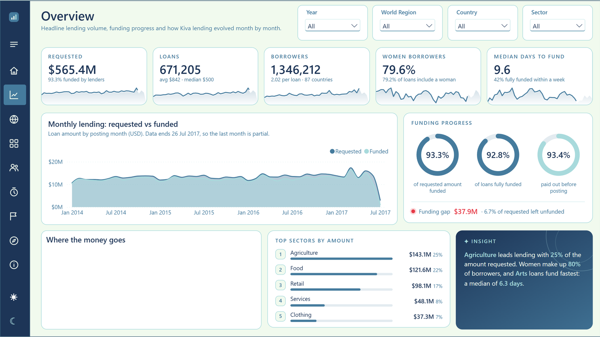

# Data Science for Good: Kiva Crowdfunding — Power BI Report

A portfolio Power BI report on **671,205 Kiva microloans (2014–2017) across 87 countries**:
who borrows, what the money pays for, how fast lenders respond, and whether funding
reaches the world's poorest regions. It combines a star-schema semantic model and
documented DAX with native visuals and animated **HTML Content** visuals. It also has a
collapsible navigation rail and a **light/dark mode toggle**.

The report is saved as a **PBIP project** (TMDL semantic model + PBIR report JSON), so
every table, measure, page and visual is plain text and diff-friendly. It was built
end-to-end with [Claude Code](https://claude.com/claude-code) using the Power BI
Modeling MCP server and the PBIR authoring CLIs.

| Light mode | Dark mode |
|---|---|
|  |  |



> **Status: work in progress.** The data model, the Home and Overview pages, and the
> navigation/theme framework on all pages are done. The analysis pages below are being built.

## Highlights

- **Star-schema model:** a `Loans` fact table (with loan themes merged in) plus conformed
  `Countries`, `Field Partners` and `Date` dimensions. `MPI Regions` and
  `Themes By Region` hang off the same dimensions. All relationships are 1:many and
  single-direction.
- **49 documented measures** in a `_Measures` table, each with a
  *Purpose / Logic / Used in* comment header, a description, a format string and a
  display folder: lending volume, funding gap, gender, funding speed, poverty (MPI)
  coverage, partners and themes.
- **Animated HTML visuals** (HTML Content custom visual): hero stats, sparklines that
  draw themselves, progress rings, leaderboards and narrative insight cards that
  update with every filter.
- **Light/dark mode:** a synced toggle drives `Color *` measures bound to backgrounds,
  text and data colours, plus CSS variables inside every HTML visual.
- **Collapsible nav rail:** icon rail plus an expandable labelled drawer (bookmark
  pairs per page), and filters (Year, World Region, Country, Sector) synced across pages.
- **Honest data handling:** MPI placeholder rows removed, country spellings
  reconciled, 29 loan countries without MPI data surfaced through an *MPI Coverage %*
  measure instead of silently blanked, and partial months and data errors flagged.

## Design system

| Token | Hex | Use |
|---|---|---|
| Punch Red | `#E63946` | Alerts and the funding gap only |
| Honeydew | `#F1FAEE` | Page background (light) / text (dark) |
| Frosted Blue | `#A8DADC` | Secondary series, borders, dark-mode accent |
| Cerulean | `#457B9D` | Primary series, interactive elements |
| Oxford Navy | `#1D3557` | Navigation, titles, dark cards |

## Report pages

| Page | Status |
|---|---|
| Home: landing page with animated stats and section cards | ✅ |
| Overview: KPI strip, monthly trend, funding rings, map, top sectors, insight | ✅ (map pending) |
| Geography & Poverty | 🚧 |
| Sectors & Activities | 🚧 |
| Borrowers & Gender | 🚧 |
| Funding Dynamics | 🚧 |
| Partners & Themes | 🚧 |
| Explore | 🚧 |
| About | 🚧 |
| Country Profile (drill-through) and tooltip pages | 🚧 |

## Repository layout

```
Data Science for Good Kiva Crowdfunding With AI.pbip             # open this in Power BI Desktop
Data Science for Good Kiva Crowdfunding With AI.SemanticModel/   # TMDL: tables, Power Query, measures
Data Science for Good Kiva Crowdfunding With AI.Report/          # PBIR: pages, visuals, theme, icons, bookmarks
_build/        # Node.js generator that writes every report page (gen.js, pages/*.js)
docs/          # screenshots
CLAUDE.md      # project log: decisions, data-quality findings, lessons learned
```

## Getting started

1. **Get the data.** Download the
   [Data Science for Good: Kiva Crowdfunding](https://www.kaggle.com/datasets/kiva/data-science-for-good-kiva-crowdfunding)
   dataset from Kaggle. The CSVs are not included in this repository (the loans file
   alone is ~187 MB). Place them in the project root with these names:
   - `kiva_loans_data.csv` (Kaggle: `kiva_loans.csv`)
   - `loan_theme_ids_data.csv` (Kaggle: `loan_theme_ids.csv`)
   - `loan_themes_by_region_data.csv` (Kaggle: `loan_themes_by_region.csv`)
   - `kiva_mpi_region_locations.csv`
2. **Install the HTML Content visual** from AppSource in Power BI Desktop
   (*Get more visuals → "HTML Content"*).
3. **Open** `Data Science for Good Kiva Crowdfunding With AI.pbip` in Power BI Desktop
   (a recent version with PBIR support).
4. **Point the data folder parameter** `pDataFolder` (Transform data → Manage parameters)
   at the folder that holds the CSVs, then **Refresh**.

To regenerate the report pages after changing the generator:

```bash
cd _build
node gen.js            # rewrites all pages, nav bookmarks and icons
```

## Data notes

- 93% of loans are **pre-disbursed**: the field partner pays the borrower before the
  loan is posted on Kiva. This is Kiva's normal model, not a data error.
- Lender counts are **lender-loan participations**. The source has no lender IDs, so
  unique lenders cannot be counted.
- Country MPI is the unweighted mean of regional MPI scores (the source has no
  population weights). "High poverty" means country MPI ≥ 0.25.
- Loans run from 1 Jan 2014 to 26 Jul 2017, so 2017 is a partial year.

## Credits

Data: [Kiva Microfunds via Kaggle](https://www.kaggle.com/datasets/kiva/data-science-for-good-kiva-crowdfunding)
(Data Science for Good). The MPI (Multidimensional Poverty Index) figures come from the
same dataset (OPHI).
